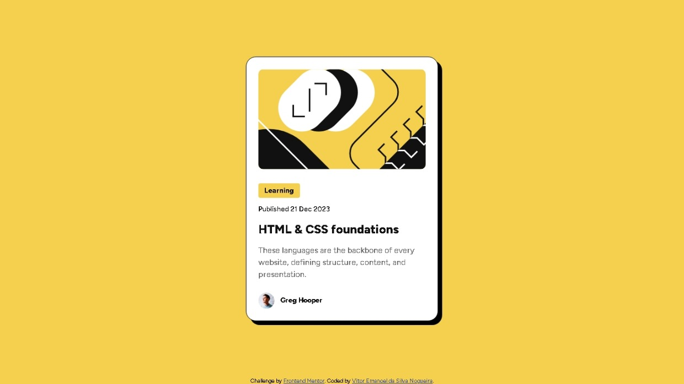

# Frontend Mentor - Blog preview card solution

This is a solution to the [Blog preview card challenge on Frontend Mentor](https://www.frontendmentor.io/challenges/blog-preview-card-ckPaj01IcS). Frontend Mentor challenges help you improve your coding skills by building realistic projects. 

## Table of contents

- [Overview](#overview)
  - [The challenge](#the-challenge)
  - [Screenshot](#screenshot)
  - [Links](#links)
- [My process](#my-process)
  - [Built with](#built-with)
  - [What I learned](#what-i-learned)
  - [Continued development](#continued-development)
- [Author](#author)

## Overview

### The challenge

Users should be able to:

- See hover and focus states for all interactive elements on the page

### Screenshot

### Links

- Solution URL: [https://github.com/VitorEmanoelNogueira/blog-preview-card](https://github.com/VitorEmanoelNogueira/blog-preview-card)
- Live Site URL: [https://vitoremanoelnogueira.github.io/blog-preview-card/index.html](https://vitoremanoelnogueira.github.io/blog-preview-card/index.html)

## My process

- Did the Semantic HTML5 markup;
- Customized the index.html using a external CSS file, starting with the mobile version;
- Used media query for tiny adjustments for the desktop version.

### Built with

- Semantic HTML5 markup
- CSS custom properties
- Flexbox
- Mobile-first workflow

### What I learned

- Improved a tiny bit in responsive web design.

### Continued development

- I want to keep focusing on responsive web design, since I'm not used as I thought to it.

## Author

- Frontend Mentor - [@VitorEmanoelNogueira](https://www.frontendmentor.io/profile/VitorEmanoelNogueira)
